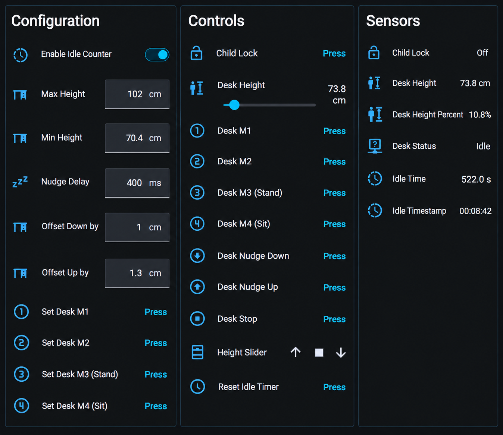
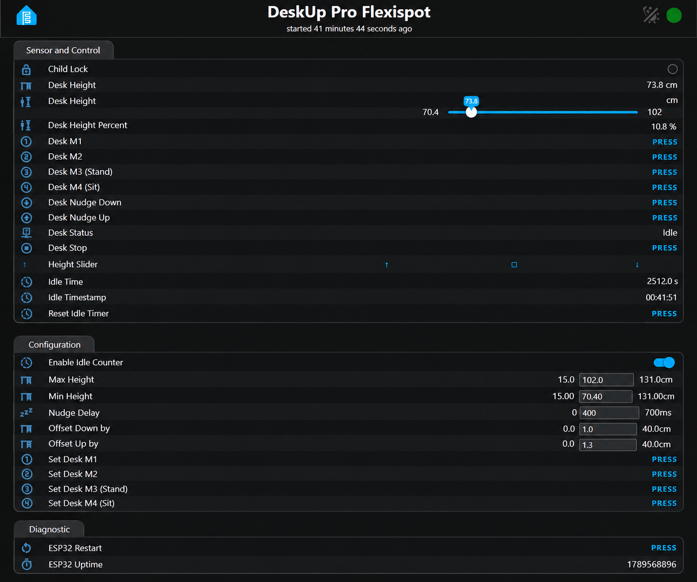

# DeskUp-Pro-Flexispot
Making FlexiSpot Standing Desks with an RJ45 Port Smart with ESPHome

<table border="0">
  <tr>
    <td><a href="#%EF%B8%8F-check-compatibility">Check compatibility</a></td>
    <td><a href="docs/setup">Setup</a></td>
    <td><a href="docs/configuration">Configure</a></td>
    <td><a href="docs/diy">DIY</a></td>
  </tr>
</table>

If your Flexispot standing desk controller has a spare RJ45 port use DeskUp Pro Flexispot to integrate your desk with your smart home automation system to control your standing desk from your phone, dashboards, automations or voice.

DeskUp Pro Flexispot has full integration with Home Assistant but any smart home hub that can send a Rest Api request is also supported using its [Api](docs/configuration/rest-api.md).

All the existing functionality of the desk's controller is retained.  Connect the DeskUp Pro Flexispot to Wi-Fi, plug it into your desk controller and control your desk from your smart home system.

## Can I buy one?
We are working to provide prebuilt devices on our store, our current estimate is by end of October/November 2026.

## What is shown in Home Assistant

    

29 entities are exposed in Home Assistant that let you control every function of the DeskUp Pro Flexispot.

## Homey Pro App (estimated to be in the app store December 2026)

    Images will be added here as we build each screen

## Other smart home systems can use the built in Web Interface and its Rest API

    

Every function of the DeskUp Pro Flexispot can be controlled using its [Api](docs/configuration/rest-api.md).

## Automations you could create for your desk
- If you're sitting down for too long, then automatically raise the desk to standing height.
  - Or announce on a smart speaker that you have been sat down too long.
  - Or maybe flash a light.
- If you ignore it then 5 mins later have it nag you to stand up until you do!
- Use voice e.g. Hey Google/Alexa raise my desk!
- After lunchtime raise the desk so you start the afternoon standing up (maybe trigger this as you walk into the room if you have a motion sensor).
- Prefer to do meetings standing up, then if your calendar is exposed to Home Assistant you could raise the desk 1 minute before your meeting starts.
- At the end of the working day lower the desk when you turn off the office light or leave the room.
- Setup a dashboard on your smart home hub so you can have an unlimited number of preset height buttons e.g. maybe each family member prefers a different sit & stand desk height.
- Want to control your desk from something else then as long as it can either integrate with Home Assistant or call a Rest Api you can.
- 
- etc, there are many possibilities.

## ⚠️ Check Compatibility
- There is **no guarantee** that the DeskUp Pro Flexispot will work with your desk as desk manufacturers can change their specifications.

- This is a product of reverse engineering, so until you try it on your desk there is no way to be 100% certain that it will or won't work.

- Your desk must have a free RJ45 port on the controller (8 pins).
  - Usually the controller will indicate an RJ45 with an 'HS' next to it.
  - This project does not support Flexispot desks with just 1 RJ45 socket (we haven't looked into a passthrough option yet)

Before you proceed check the compatibility of your desk.  You should understand the risks before purchasing or building the diy option, it's your responsibility to determine if its fit for your purpose. 

### Compatible Desks or Controllers (Confirmed by the community)
- Flexispot E7 Mini (controller CB38M2M(IB)-1 and keypad HS13G-1)
- Flexispot E7 Pro (controller CB38M2M(IB)-4 and keypad HS13G-1)

### Specs
- The firmware of the DeskUp Pro is based on ESPHome
- The device itself uses an ESP32-C6 chip that is powered by the desk's controller over the RJ45 Cable, so no USB cable is needed to power it.
- Has a USB-C port for setup.
- Wi-Fi protocol used is 2.4ghz.
- Initial setup of the device to connect it to Wi-Fi can be done using a USB-C cable, Bluetooth (if you use Home Assistant and have a Bluetooth proxy).

### More Product Images and Dimensions

    Will be added here as they become available 

### What's in the box if I bought one?
- DeskUp Pro Flexispot device flashed with the latest firmware
- Housed in a 3D printed case
- RJ45 cable (Optional)
- Getting started guide

## Prefer to build one yourself 
DeskUp Pro Flexispot will always remain open source and in this Github repository you can find:

- Instructions on how to build/wire up the ESP32.
- The full source code to control the desk written using community reverse engineered desk logic (from multiple git repos) we pulled together what we thought were the best bits into this project.
- We decided to make this a yaml only version of the code to make it easier for non c++ programmers to understand and change.
- Then added a number of our own features to it from our popular DeskUp Pro RJ12 product.
- You will need to use ESPHome Builder in Home Assistant to follow our guide.

However if you would prefer to avoid:
- Buying the parts
- Putting it all together
- Designing or purchasing a 3d printed a case
- Downloading & flashing the firmware

And would simply like to get the device pre-built, in a box that you can plug in to your desk and be automating it in 5 minutes then you can purchase one from our store.

    Estimated to be available in the store by end of October/November 2026

## Documentation
[Setup a purchased device](docs/setup/README.md)

[Build one yourself](docs/diy/README.md)

[Configure the device for your smart home hub](docs/configuration/README.md)

## Need Help
Log an issue to this Git Repo and we will try to help, or even better submit a pull request with the change.

## Why did I start this project?
I originally wrote the <a href="https://github.com/SmartHomeGuys/DeskUp-Pro-Controller-RJ12" target="_new">DeskUp Pro RJ12</a> because I was finding I sat down at my desk too much and this was causing Sciatica so I wanted to integrate the desk into my Smart Home System and have Alexa nag me to stand up more!

My partner then said they wanted a standing desk for similar reasons so I thought why buy the same desk when I can do another cool project with a Flexispot desk whilst trying to port over as many features as possible from the original Desk Up Pro.

That's when I decided to do the same I did with the original DeskUp Pro:
- Fully document everything I have done into this Git repository.
- Make the device accessible not only to Home Assistant but to any Smart Home system that can call a Rest Api.
- Sell DeskUp Pro Flexispot devices to anyone that just wants to plug it in and start automating, but in the spirit of open source if you want to build your own all the details to do that are in here too.

### License
This project is licensed for **personal, non-commercial use only**.  
Redistribution, resale, or commercial use is **not permitted**.  
See the [LICENSE](./LICENSE) file for details.

