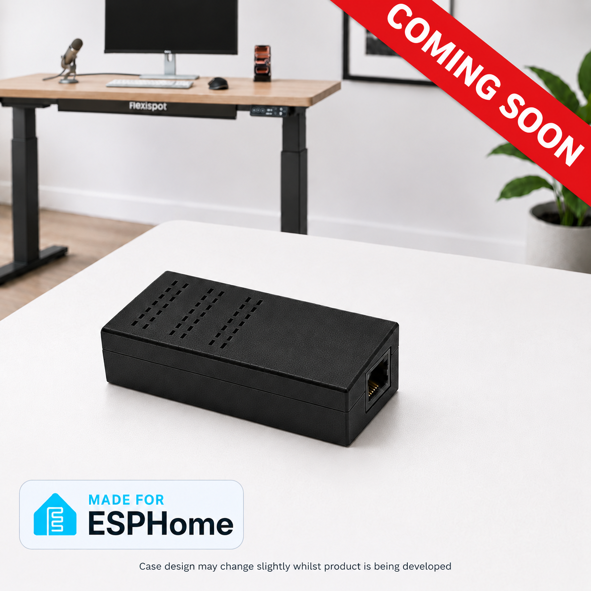
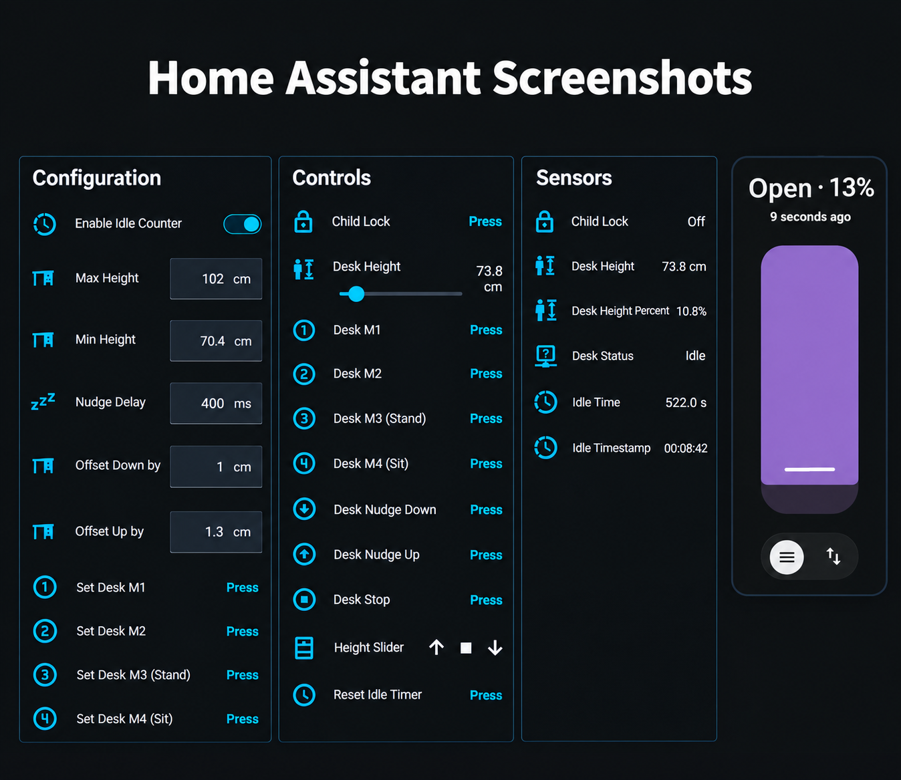

# DeskUp Pro Flexispot
Making FlexiSpot Standing Desks Smart with ESPHome.

***This repository is for Flexispot desks only, if you are looking for the DeskUp Pro for desks with an RJ12 port <a href="https://smarthomeguys.github.io/DeskUp-Pro-Controller-RJ12/">click here</a>.***

<table border="0">
  <tr>
    <td><a href="#%EF%B8%8F-check-compatibility">Check compatibility</a></td>
    <td><a href="docs/setup">Setup</a></td>
    <td><a href="docs/configuration">Configure</a></td>
    <td><a href="docs/diy">DIY</a></td>
  </tr>
</table>

If your Flexispot standing desk controller has a spare RJ45 port use DeskUp Pro Flexispot to integrate your desk with your smart home automation system to control your standing desk from your phone, dashboards, automations or voice.

DeskUp Pro Flexispot has full integration with Home Assistant.

All the existing functionality of the desk's controller is retained.  Connect the DeskUp Pro Flexispot to Wi-Fi, plug it into your desk controller and control your desk from your smart home system.

## There are other Flexispot repositories out there what's different about this one?
- We pulled together what we thought were the best bits from each into this project.
- We decided to make this a yaml only version of the code to make it easier for non c++ programmers to understand and change.
- We added a number of our own features to it such as improving the nudge button so it doesn't move its default of around 4cm which isnt really a nudge but one that can be configured by you to be alot less.
- We reused some features from our popular DeskUp Pro RJ12 product and made the UI very similar including being able to configure everything from the UI instead of config (except for setting the device to cm or inches).

  

  

## What is shown in Home Assistant

    

29 entities are exposed in Home Assistant that let you control every function of the DeskUp Pro Flexispot.

## Automations you could create for your desk
- If you're sitting down for too long, then automatically raise the desk to standing height.
  - Or announce on a smart speaker that you have been sat down too long.
  - Or maybe flash a light.
- If you ignore it then 5 mins later have it nag you to stand up until you do!
- Use voice e.g. Hey Google/Alexa raise my desk!
- After lunchtime raise the desk so you start the afternoon standing up (maybe trigger this as you walk into the room if you have a motion sensor).
- Prefer to do meetings standing up, then if your calendar is exposed to Home Assistant you could raise the desk 1 minute before your meeting starts.
- At the end of the working day lower the desk when you turn off the office light or leave the room.
- Setup a dashboard on your smart home hub so you can have an unlimited number of preset height buttons e.g. maybe each family member prefers a different sit & stand desk height.
- Want to control your desk from something else then as long as it can either integrate with Home Assistant or call a Rest Api you can.
- If you work at a company maybe you could automatically raise all the desks in the office to help the cleaners vacuum underneath easier.
- etc, there are many possibilities.

## ⚠️ Check Compatibility
There is **no guarantee** that the DeskUp Pro Flexispot will work with your desk as Flexispot could change their specifications (although that's unlikely if its in the lists above).

Your desk must have a free RJ45 port on the controller (8 pins).  Usually the controller will indicate an RJ45 with an 'HS' next to it.  This project does not support Flexispot desks with just 1 RJ45 socket (we haven't looked into a passthrough option yet)

**It's your responsibility** to determine if it's fit for your purpose before purchasing or building.

**Every desk known to us** that works or doesn't is in the lists above.  If your desk is not on the list we cannot advise on its compatibility until someone tries it and tells us. Where controller model numbers are similar there is a high chance of compatibility.

### Compatible Desks or Controllers (confirmed by us and the community)
<table>
<tr><th>Desk Model</th><th>Controller</th><th>Keypad</th></tr>
<tr><td>E7 Mini (2026 model)</td><td>CB38M2M(IB)-1</td><td>HS13G-1</td></tr>

<tr><td>E7 Pro (2026 model)</td><td>CB38M2M(IB)-4</td><td>HS13G-1</td></tr>

<tr><td>E7Q</td><td>CB38M4A(IB)-1</td><td>HS13G-1</td></tr>
</table>

### Desks very likely to be compatible with the DeskUp Pro code
Desks in this section haven't been tested on the code in this repo yet but we believe they will be compatible.

_If you try the DeskUp Pro Flexispot on any of the desks below or on any not listed please let us know by creating a pull request or open an issue so we can add it here to help others_

- Any other E7 2026 model with a spare RJ45 port e.g Standard, Flow

- E7 - controller CB38M2J(IB)-1 and keypad HS13B-1
<a href="https://github.com/iMicknl/LoctekMotion_IoT?tab=readme-ov-file#hs13b-1">Confirmed this uses the same controller pins as us and was listed in the iMicknl repo</a>

- E5B - Controller CB38M2A-1 and keypad HS01B-1 <a href="https://github.com/iMicknl/LoctekMotion_IoT?tab=readme-ov-file#hs01b-1">Confirmed this uses the same controller pins as us and was listed in the iMicknl repo</a>

_If your desk is not on the list we cannot advise on its compatibility until someone tries it and tells us to update these lists._

### Incompatible Desks or Controllers 
- EK5 - Controller CB38M2B(IB)-1 and keypad HS13A-1 (has different wiring was mentioned on the iMicknl repo).
- E1 Pro
- E5 Standard
- Any desk without 1 spare RJ45 socket

## Prefer to build one yourself 
DeskUp Pro Flexispot will always remain open source and in this Github repository you can find:

- Instructions on how to build/wire up the ESP32.
- The full source code to control the desk written using reverse engineered desk logic worked out by the community and us.
- We pulled together from multiple git repos what we thought were the best bits into this project.
- We decided to make this a yaml only version of the code to make it easier for non c++ programmers to understand and change.
- Then added a number of our own features to it and reused some from our popular DeskUp Pro RJ12 product.
- You will need to use ESPHome Builder in Home Assistant to follow our guide.

However if you would prefer to avoid:
- Buying the parts
- Putting it all together
- Designing or purchasing a 3d printed a case
- Downloading & flashing the firmware

And would simply like to get the device pre-built, in a box that you can plug in to your desk and be automating it in 5 minutes then you can purchase one from our store.

  

## Documentation
[Setup a purchased device](docs/setup/README.md)

[Build one yourself](docs/diy/README.md)

[Configure the device for your smart home hub](docs/configuration/README.md)

## Need Help
Log an issue to this Git Repo and we will try to help if we can, or even better submit a pull request with the change.

## Why did I start this project?
I originally wrote the <a href="https://github.com/SmartHomeGuys/DeskUp-Pro-Controller-RJ12" target="_new">DeskUp Pro RJ12</a> because I was finding I sat down at my desk too much and this was causing Sciatica so I wanted to integrate the desk into my Smart Home System and have Alexa nag me to stand up more!

My partner then said they wanted a standing desk for similar reasons so I thought why buy the same desk when I can do another project with a Flexispot desk whilst trying to retain as many features as possible from the original Desk Up Pro.

That's when I decided to do the same I did with the original DeskUp Pro:
- Fully document everything I have done in this Git repository.
- Make the device accessible not only to Home Assistant but to any Smart Home system that can call a Rest Api.
- Sell DeskUp Pro Flexispot devices to anyone that just wants to plug it in and start automating, but in the spirit of open source if you want to build your own all the details to do that are in here too.

### License
This project is licensed for **personal, non-commercial use only**.  
Redistribution, resale, or commercial use is **not permitted**.  
See the [LICENSE](./LICENSE) file for details.

