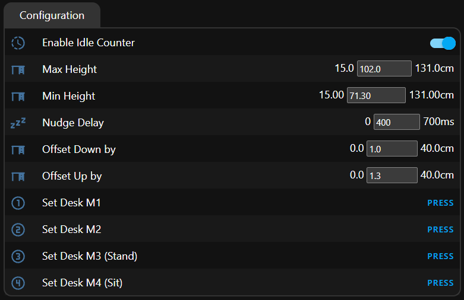

# Configure the DeskUp Pro Flexispot in Home Assistant

Before you use the DeskUp Pro Flexispot make sure to specify your desks min / max physical limits and familiarise yourself with the screen layout here:

[Screen Layout and what it all does](screen-layout/README.md)


# Home Assistant Examples

[Example Dashboard](home-assistant-dashboard.md)


# Configure and use the DeskUp Pro with another Smart Home Hub

Before you use the DeskUp Pro Flexispot make sure to specify your desks min / max physical limits using the built in Web server.  
[Read this page on why this is important](screen-layout/screen-layout-configuration.md#max-height-defaults-to-cm).
You can also control every aspect of the DeskUp Pro Flexispot with this interface.

To open the DeskUp Pro Flexispot web interface enter this in a web browser: 
```
http://device-ip-number
```

<p align="center">
  
</p>

Once the device is configured with Min Height and Max Height values that match your needs use the rest api from your smart home hub to control your desk.

[Rest API](rest-api.md)