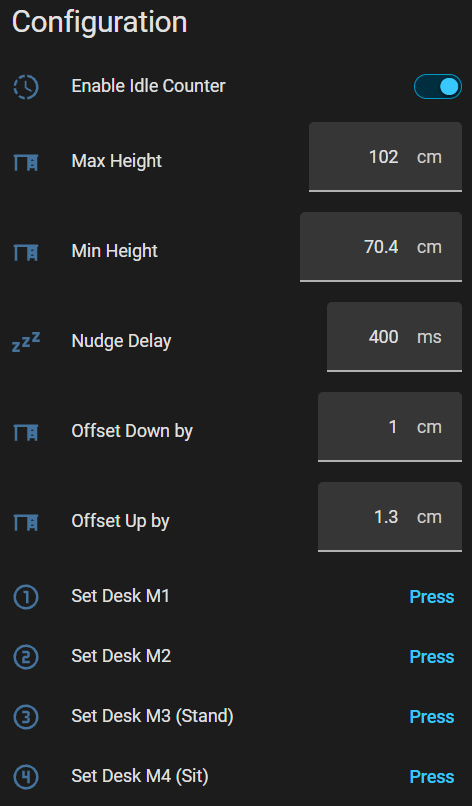

# Home Assistant Screen Layout - What it all does - Configuration 

Before using your DeskUp Pro you need to configure the min & max height values for your desk:

<table border="0">
  <tr><th>Home Assistant</th><th></th></tr>
  <tr>
    <td valign="top">
      
    </td>
  </tr>
</table>

### Enable Idle Counter

This turns on/off the 2 sensors Idle Time & Idle Timestamp.  This is for the people who do not want the data sent to Home Assistant e.g. you wont be using these sensors on any dashboards.

### Max Height (defaults to cm)

You should set this to either:
  - Match your desks physical maximum height limit. If you dont know it just raise your desk to its maximum height and use the value from the desk control panel here.
    
  - Or set the desk to be the maximum height you will use on a day to day basis.

    Doing this gives you a better experience when using the cover slider as this has go up (100%) & go down (0%) buttons.

    _Note: This does not prevent you using memory preset buttons or nudge up/down controls to move the desk outside of this range._

  
### Min Height (defaults to cm)

The instructions are the same as the description above, just for setting the minimum height.

### Nudge Delay (ms)
Text box to manually add a delay (in ms) when the nudge up/down controls are used. It's only used by these 2 controls.

This was key to preventing the nudge command just moving its default height when 1 height hex command is sent.

The default height seems to vary but on average going up by 4.3 (+-0.1) and going down by 3.7 (+-0.4)

This box lets you drastically reduce this, but it's not 100% guaranteed to prevent the default happening but seems to work quite reliably.

### Offset Down By (defaults to cm)

Use this to fine tune the distance the desk travels when using the cover & desk height slider controls.  Note this is never going to be 100% accurate on Flexispot desks where you say move to 89.7cm it will sometimes be this but usually pretty close to it.

1cm worked well for my desk.

### Offset Up By (defaults to cm)

Same description as above, and 1.3cm worked well for my desk.

### Set Desk M1, M2, M3, M4 buttons
Pressing these will set the current desk's height in to the corresponding memory number preset on the desk's controller.

