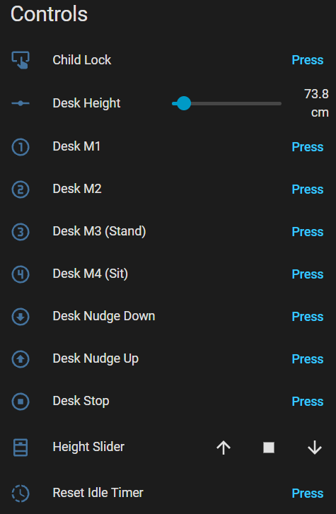

# Home Assistant Screen Layout - What it all does - Controls

All these controls can be pressed in automations.

<table border="0">
  <tr><th>Home Assistant</th><th></th></tr>
  <tr>
    <td valign="top">
      
    </td>
  </tr>
</table>

### Child Lock
Turn on/off the child lock on the desks controller.  When activated no commands can be sent to the desk from the DeskUp Pro or by manually using the desk's controller.

### Desk Height (defaults to cm)
Shows the height of the desk that is being returned from the desk's controller. But also let's you set the height of the desk using the slider or from an automation.

### Desk M1, M2, M3, M4 Buttons
When pressed moves the desk to the height set in the memory preset.

### Desk Nudge Down / Up Buttons
When pressed moves the desk up or down (how far it moves can be configured in the configuration section 'Nudge Delay').

### Desk Stop
The stop button only stops the desk moving if it was started using the height slider or cover control.

It has no effect if the memory preset buttons were used (pressing one of those stops the desk immediately too).

### Height Slider
It uses the desk height percent sensor to determine its value (0% to 100%).

You can control the desk using the cover slider.

An added benefit of having a Cover entity exposed to Home Assistant and Homey Pro is it can also be integrated to Google Home where the desk can be controlled by voice. 

### Reset Idle Time 
When pressed sets the Idle Time sensor back to 0.

### ESP32 LED (C6 Chips)
Is not exposed to Home Assistant as a control because C6 chips only support a single colour. It slowly flashes yellow when disconnected from Wi-Fi or disconnected from Home Assistant.  If everything is connected ok it turns off.
