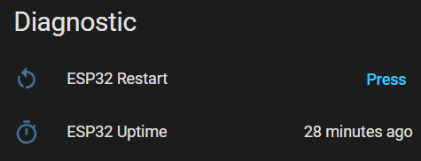

# Home Assistant Screen Layout - What it all does - Diagnostics

<table border="0">
  <tr><th>Home Assistant</th><th></th></tr>
  <tr>
    <td valign="top">
      
    </td>
  </tr>
</table>

### ESP32 Restart
Pressing this will reboot the device.

### ESP32 Uptime
Shows how long the device has been online for.
