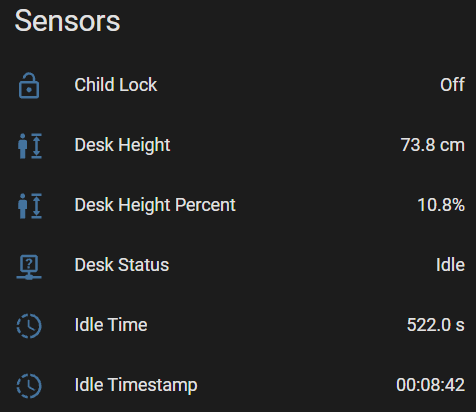

# Home Assistant & Homey Pro Screen Layout - What it all does - Sensors

<table border="0">
  <tr><th>Home Assistant</th></tr>
  <tr>
    <td valign="top">
      
    </td>
  </tr>
</table>

### Child Lock
Shows if the child lock is turned On or Off.

### Desk Height (defaults to cm)
Shows the height of the desk that is being returned from the desk's controller.

### Desk Height Percent
Shows the height of the desk as a percentage value. This is used by the Cover control which can go from 0% to 100%.

### Desk Status
Shows if the desk is currently Idle, Raising, or Lowering.

### Idle Time (seconds)
Timer on the DeskUp Pro device that counts the number of seconds the desk has been idle/not moved for.

Use this sensor in automations when you want to trigger an automation to start after the desk has been idle for X number of seconds.

### Idle Timestamp (days, hh:mm:ss)
Converts the idle seconds into a timestamp value that can be displayed on a dashboard.

Days will only be shown if the desk is idle for 1 day.

e.g. 2 days, 04:45:02 

or just 04:45:02 (if days is 0)
