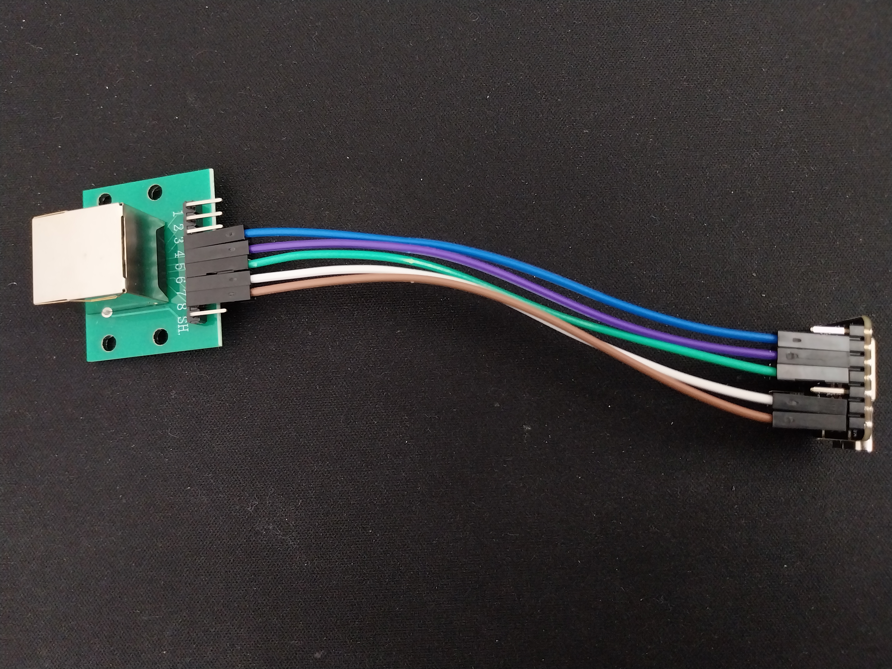
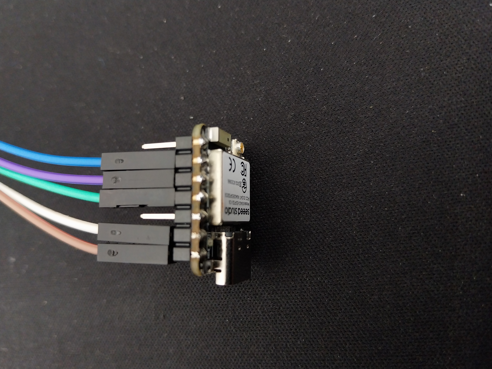
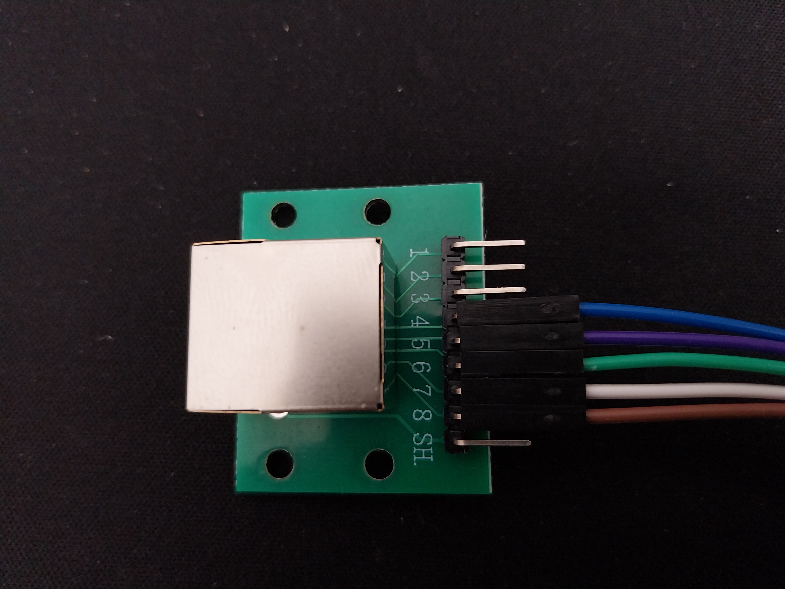

# Everything you need to know to build a DeskUp Pro Flexispot device yourself

To automate your desk, what we are going to make is the cable below with an RJ45 port at one end and wire it up to an ESP32 at the other.  But before you buy anything check the likely compatibility of your [desk here](../compatibility.md).

## Materials needed
- An ESP32, we used a SeeedStudio XIAO ESP32-C6. 

- An RJ45 Cable (T568B) orange wire on the side not the middle.

- Dupont wires

- RJ45 Breadout board

## RJ45 to ESP32-C6 Pin Mapping

| RJ45 Pin | RJ45 Cable Colour | Dupont Colour | ESP32 Pin Used |
| ---- | ---- | ---- | ---- |
| PIN 1 | Orange/White | Unused | Unused |
| PIN 2 | Orange | Unused | Unused |
| PIN 3 | Green/White | Unused | Unused |
| PIN 4 | Blue | Blue | Virtual Screen - GPIO19 |
| PIN 5 | Blue/White | Green | TX - GPIO18 |
| PIN 6 | Green | Purple | RX - GPIO20 |
| PIN 7 | Brown/White | White | GND |
| PIN 8 | Brown | Brown | 5V |

## 3D Print a Box
Design your own enclosure.

## Home Assistant Configuration
if you used the same SeeedStudio XIAO ESP32-C6 and gpio pins as us you can just flashbthe device using our firmware from here: 

You first need to setup the ESP32 in Home Assistant which can be done within Home Assistant using ESPHome Builder.

You will need to do this from a laptop/PC. Attach the ESP32 via a USB-C cable to a USB-A or C port on your laptop and then click add a ‘New Device’ and follow the prompts.

Once you have the ESP32 device connected to your Wi-Fi you won’t need the USB cable once we are finished.

You should now have this showing in ESPHome Builder.

### Let’s set up the ESP32 with the desk controller software.

TODO: Finish this section
