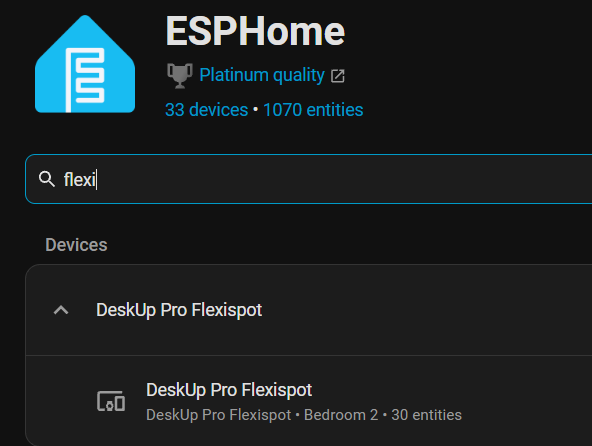

# Add the device to Home Assistant

Once the device is connected to Wi-Fi it should automatically be detected as a new device by Home Assistant.

TODO ADD IMAGE 

Click ‘Add’ to add this device to Home Assistant.

You will be prompted with this popup box, click 'Submit'.

TODO ADD IMAGE 

You will now be asked to choose an Area in HomeAssistant for the device.

Click 'Finish' and a "DeskUp Pro Flexispot" device will now appear under the ESPHome Integration.

You can now optionally 'Adopt' the device in ESP Home by [following this guide](adopting-in-home-assistant.md).