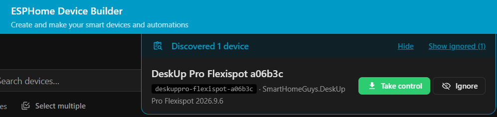
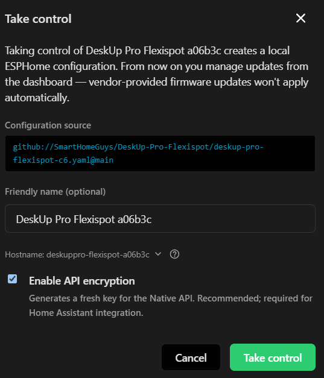
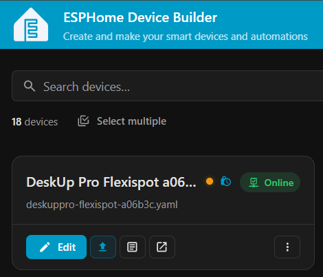
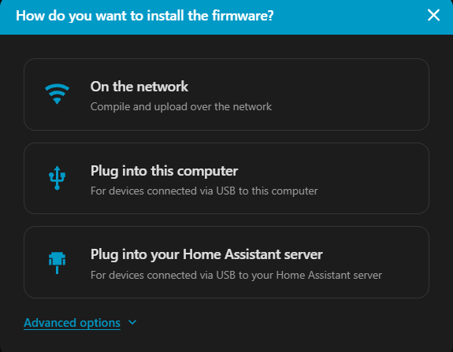
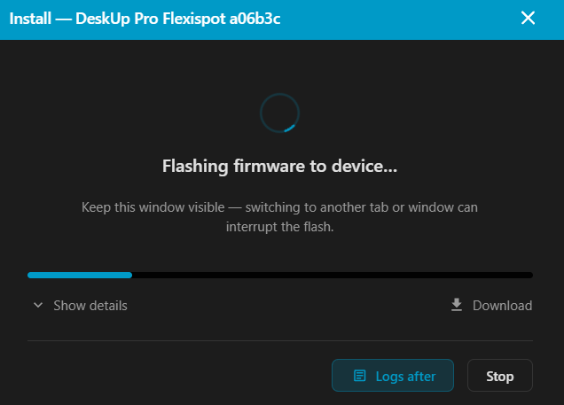

# Adopting the device into ESPHome Builder

After the device is added to Home Assistant you will get any updates in Home Assistant as you normally would.

However if you want more control over the device then you can ‘Adopt’ the device into ESPHome Builder. To do this you must plug the device directly into a laptop, you cannot adopt the device over the air (OTA).

Go to ESPHome Builder in Home Assistant where it should be saying a device has been discovered.
If it’s not, try restarting the ESP Home Device Builder App in Home Assistant.



Click 'Show' and the following box appears.



You have the opportunity to rename the device, click 'Take Control' when ready.

The device will now be shown on the ESPHome dashboard.




Click 'Install' and choose "Plug into this computer" to compile the code and flash it to the device.





Note: If the upload fails just click 'Retry'.

Once the upload is completed the ESP32 logs will start streaming, you can just click 'Close'.

To further secure your device it is recommended to:
- Set a username / password on the Web Server to prevent anyone other than yourself controlling the desk, by adding this yaml:

```
web_server:
  auth:
    type: digest
    username: !secret webserver_deskuppro_username
    password: !secret webserver_deskuppro_password
```